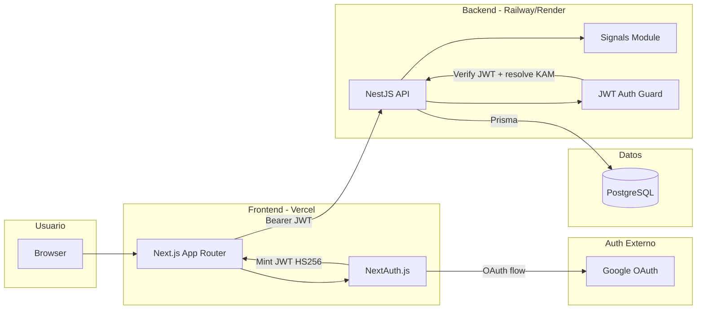

# Arquitectura

## Diagrama

## Flujo de autenticación

1. El usuario inicia sesión con Google vía NextAuth en el frontend.
2. En el callback JWT de NextAuth, se firma un token HS256 con `JWT_SECRET` que contiene `{ email, name }`.
3. El frontend envía ese token como `Authorization: Bearer` en cada request a la API.
4. El `JwtAuthGuard` del backend verifica el token con el mismo `JWT_SECRET`, busca el `Kam` por email y filtra la cartera.
5. Si el email no corresponde a un KAM registrado, se retorna `403`.

**Modo mock:** Con `AUTH_MODE=mock`, NextAuth usa un `CredentialsProvider` que autentica automáticamente como el KAM de demo (`demo@xepelin.com`), sin necesidad de Google OAuth.

## Capas

### Frontend (`/web`)
Next.js 14 con App Router, Mantine v7 para UI, Recharts para gráficos. Cliente puro: consume la API vía fetch, sin lógica de negocio en route handlers. NextAuth maneja la sesión y mintea el JWT para el backend.

### Backend (`/api`)
NestJS con arquitectura modular: `controller → service → Prisma`. El módulo `signals/` es dominio puro (sin dependencias de framework) y calcula métricas, riesgo de churn, oportunidades de expansión y prioridad on-read. DTOs validados con `class-validator`, guard JWT con Passport.

### Base de datos
PostgreSQL con Prisma ORM. Schema con enums nativos, Decimal para montos, índices compuestos en `(companyId, date)` para operaciones e interacciones. Columnas IA nullable preparadas para la Parte 2.
